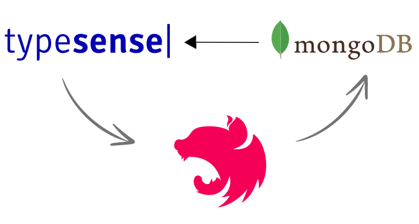

<div align="center">
    <br/>
    <h3>Typesense module for NestJS</h3>
</div>

# Overview

### About Typesense

Typesense is an open-source, typo-tolerant search engine optimized for instant (typically sub-50ms) search-as-you-type experiences and developer productivity.

If you've heard about ElasticSearch or Algolia, a good way to think about Typesense is that it is:
- An open source alternative to Algolia, with some key quirks solved and
- An easier-to-use batteries-included alternative to ElasticSearch

Read more about Typesense at [here](https://typesense.org/docs/overview/what-is-typesense.html)

### Main Feature

| Name | Supported versions |
|----------|----------|
| Register typesense global | V1.0.0 |
| Register schema for specified module | V1.0.0 |
| Auto migrate schemas | V1.0.0 |
| Auto sync data from MongoDB | V1.0.0 |

# Installation

### Setup Typesence and MongoDB

- **For cloud or self-hosted**:
  - **Install Typesense**: Please follow [This guide](https://typesense.org/docs/guide/install-typesense.html).
  - **Install MongoDB**: Please follow [This guide](https://www.mongodb.com/docs/).
    
  - **Setup replica set for MongoDB**:
    - Option 1: [Deploy replica set on MongoDB cloud](https://www.mongodb.com/docs/cloud-manager/tutorial/deploy-replica-set/) (If you use MongoDB Cloud).
    - Option 2: [Setup replica set on MongoDB self-hosted](https://www.mongodb.com/docs/manual/replication/) (If you use MongoDB Self-hosted).
    
- **For docker compose**: You could follow the steps below to quick installation.
  
1. **Config your environment**:

   Create a `.env` at root your project and copy those variables below to your `.env` file:

   MongoDB variables environment:
   
   ```env
    # MongoDB config
    MONGO_BD_NAME='your mongoDB database name'
    MONGO_USERNAME='your mongoDB username'
    MONGO_PASSWORD='your mongoDB password'
    MONGO_PORT=27017
    MONGO_HOST='your mongoDB host'
   ```

   Typesense variables environment:
   
   ```env
    # typesense config
    TYPESENSE_HOST='your Typesense host'
    TYPESENSE_PORT=8108
    TYPESENSE_PROTOCOL=http
    TYPESENSE_API_KEY='your api key'
   ```

   Notice: You can run command `openssl rand -hex 32` to generate your api key.
   
2. **Docker compose config file**:

   Define your network:

   ```yaml
   # docker-compose.yml
   ...
   networks:
       your_network_name:
           driver: bridge
   ...
   ```

   Define mongo service:

   ```yaml
   # docker-compose.yml
   ...
   services:
      mongo:
          build:
              dockerfile: .docker/mongo/Dockerfile
          container_name: typesence-mongo-db
          restart: always
          environment:
              MONGO_INITDB_ROOT_USERNAME: $MONGO_USERNAME
              MONGO_INITDB_ROOT_PASSWORD: $MONGO_PASSWORD
          ports:
              - '${MONGO_PORT}:27017'
          command: --replSet rs0 --keyFile /etc/mongo-keyfile --bind_ip_all --port $MONGO_PORT
          healthcheck:
              test: echo "
                  try { rs.status() }
                  catch (err) {
                      rs.initiate({
                          _id:'rs0',
                          members:[{ _id:0, host:'127.0.0.1:27017' }]
                      })
                  }" | mongosh --port $MONGO_PORT -u $MONGO_USERNAME -p $MONGO_PASSWORD --authenticationDatabase admin
              interval: 5s
              timeout: 15s
              start_period: 15s
              retries: 10
          networks:
              - typesence_mongo_network
          volumes:
              - typesence_mongo:/data/db
   ...
   ```

   Define Typesense service:

   ```yaml
   # docker-compose.yml
   ...
       typesense:
          image: typesense/typesense:27.0.rc2
          container_name: typesense-data-search
          ports:
              - '${TYPESENSE_PORT}:8108'
          volumes:
              - typesense-data:/data
          command: '--data-dir /data --api-key=${TYPESENSE_API_KEY} --enable-cors'
          networks:
              - typesence_mongo_network
   ...
   ```
  volumes:
      typesense-data:
      typesence_mongo:
  ```
